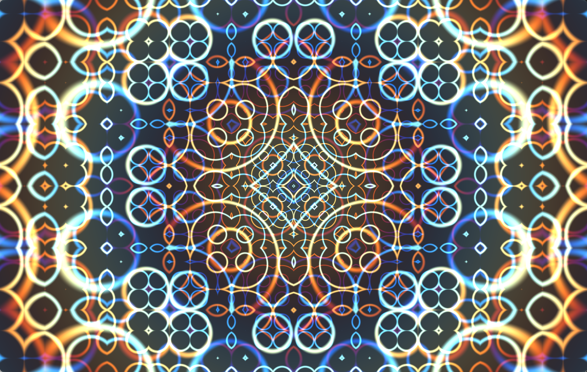

# Shaders

Credit: [Joey de Vries](https://github.com/JoeyDeVries) for their awesome tutorial [LearnOpengl.com](https://learnopengl.com/Getting-started/Hello-Window)

Credit: [kishimisu](https://www.youtube.com/@kishimisu) for their video [An Introduction to Shader Art Coding](https://www.youtube.com/watch?v=f4s1h2YETNY)

---

Getting Started
---

1. Run [`./build.sh`](./build.sh) to install all dependencies and build the project.
    - Run [`./build.sh -i`](./build.sh) to re-install dependencies.
    - Run [`./build.sh -w`](./build.sh) to run in **watch mode**, which continuously re-compiles your code when you make changes.

2. Run [`./build/Shaders`](./build/Shaders) to run the project.

License
---
Copyright (c) 2023 Seth Traman

This software is provided 'as-is', without any express or implied
warranty. In no event will the authors be held liable for any damages
arising from the use of this software.

Permission is granted to anyone to use this software for any purpose,
including commercial applications, and to alter it and redistribute it
freely, subject to the following restrictions:

1. The origin of this software must not be misrepresented; you must not
   claim that you wrote the original software. If you use this software
   in a product, an acknowledgment in the product documentation would be
   appreciated but is not required.
2. Altered source versions must be plainly marked as such, and must not be
   misrepresented as being the original software.
3. This notice may not be removed or altered from any source distribution.